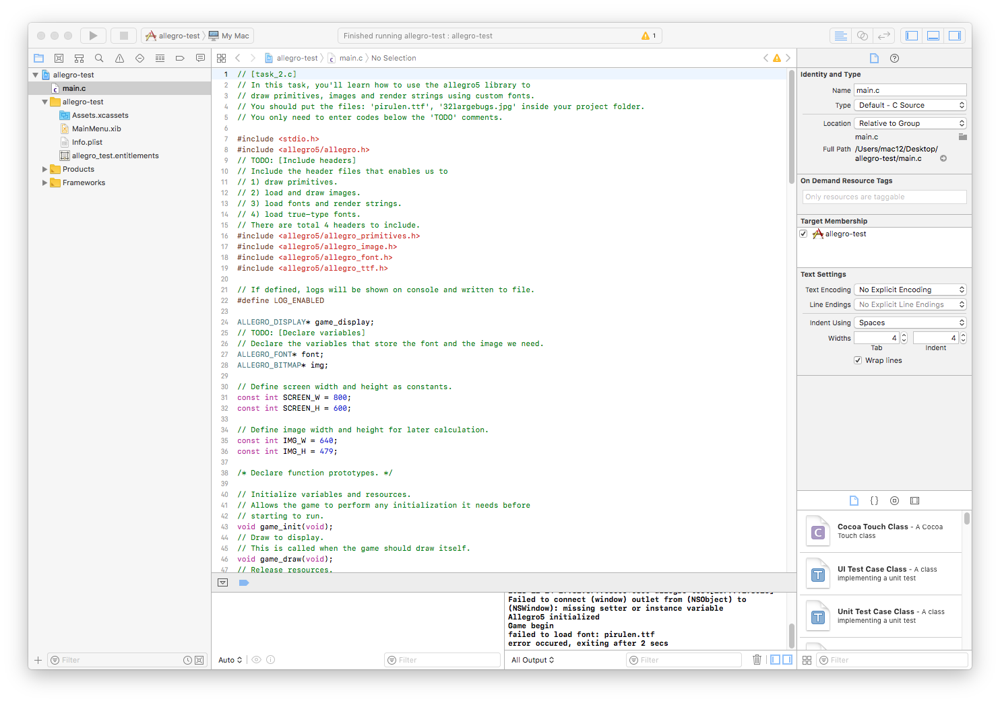
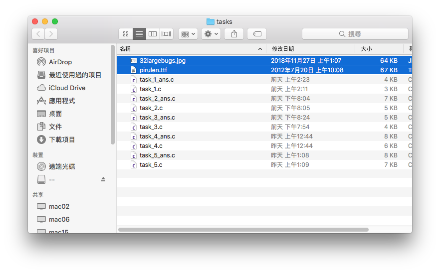
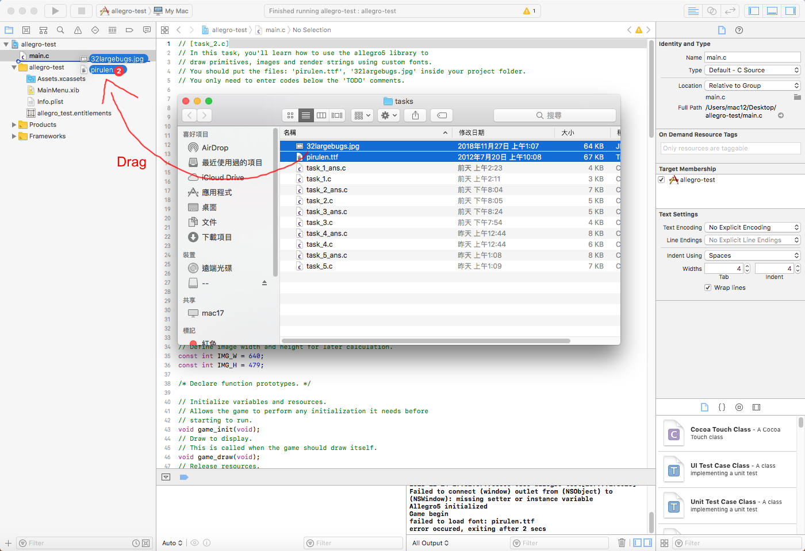
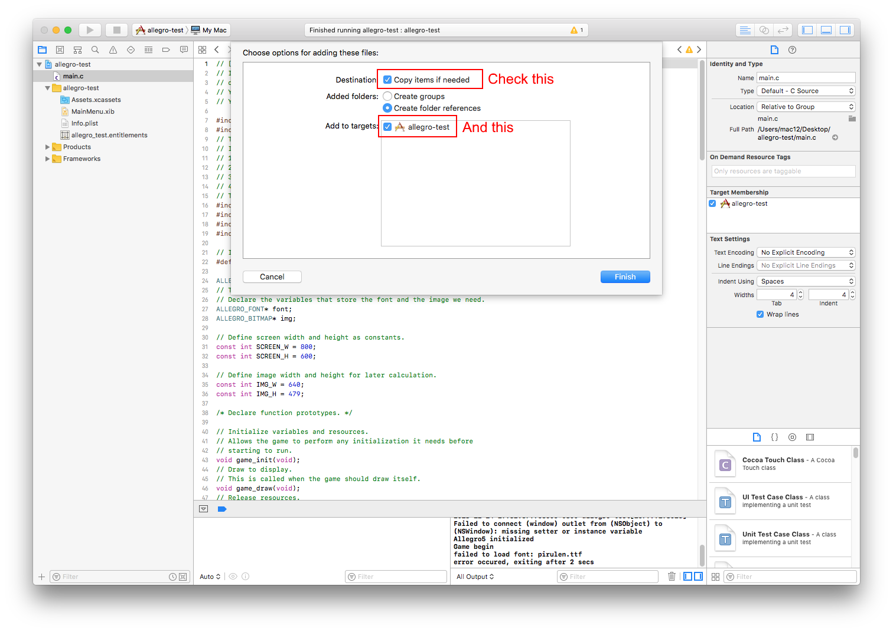
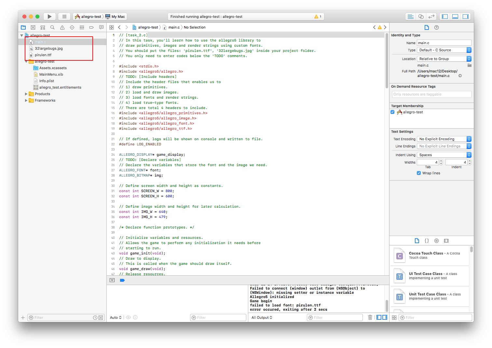

# Allegro 5 Template for I2P(1)_2018_SR

We will use Allegro 5 in the final project.

## Administrative

[iLMS Course Site](https://lms.nthu.edu.tw/course/35278)

- 12/13 (四) Allegro5 簡介

  希望在講解前大家可以先把 Allegro5 在自己電腦上裝好。

- 12/16 (日) 09:00-20:00 黑客松 (占總成績 2%)
- 01/14 (一) Demo, 詳情一週前會公布 (占總成績 13%)

Tasks: [tasks](/tasks), [task video](https://youtu.be/Araij6j6QME)

PPT: [allegro5_tutorial.pdf](/allegro5_tutorial.pdf)

## Installation

Follow the steps [here](docs/README.md).

- [Windows](docs/README.md#windows)
  - [Code::Blocks](docs/README.md#codeblocks): [Video](https://youtu.be/6qzWKRxw9eY), [Old Version](https://youtu.be/8A6DHSo3KT8?t=1)
  - [Dev-C++](docs/README.md#dev-c): [Video](https://youtu.be/lwscVtIUy6k)
  - [Visual Studio](docs/README.md#visual-studio): [Video](https://youtu.be/HPHd92nj0Io)
- [Mac OS](docs/README.md#mac-os)
  - [XCode](docs/README.md#xcode): [Video](https://youtu.be/7nJNDRCq5o0)
- [Others](docs/README.md#others)

<!--## Examples-->

## Useful Links

- Official Site

  [Allegro - A game programming library](https://liballeg.org/)

- Documentations

  [Allegro 5 reference manual](https://liballeg.org/a5docs/trunk/)

  [Allegro 5.0 reference manual](https://www.allegro.cc/manual/5/)

- GitHub repo

  [Source Code](https://github.com/liballeg/allegro5)

  [Examples](https://github.com/liballeg/allegro5/tree/master/examples)

## Tutorials

[C++ Allegro 5 Made Easy](https://www.youtube.com/watch?v=IZ2krJ8Ls2A&list=PL6B459AAE1642C8B4 )

[2D Game Development Course](http://fixbyproximity.com/2d-game-development-course/)

[Allegro Game Library Tutorial Series](https://www.gamefromscratch.com/page/Allegro-Tutorial-Series.aspx)

## FAQ

### Final Project

- If you want to use GIF images, you can download the plugin [algif](http://algif.sourceforge.net/).

  It can be used like videos after putting the library under your project folder.

- If you play multiple BGMs or sound effects at the same time, the `al_play_sample` could fail.

  You can either:
  
  1. Set `RESERVED_SAMPLES` to a higher value.
  2. Don't abort if `al_play_sample` fails.

- Unable to find resources when open the executable file located in `...\bin\` directly.

  You can copy all used resources to the `...\bin` folder, since the executable file searches for the resources file located in the same folder.

- Error message: `assertion failed ... bitmap_draw...`

  A high chance is that you didn't initialize one of your image file before drawing it. e.g.

  ```c
  ALLEGRO_BITMAP* img;
  ...
  al_draw_bitmap(img, ...);
  ```

  The full error message:
  ```
  Assertion failed!

  Program: <PATH>\final.exe
  File: <PATH>/bitmap_draw.c, Line 140

  Expression: bitmap
  ```

- `al_load_bitmap`, `load_resized_bitmap` keeps failing, but I've done nothing wrong.

  Some image files you downloaded from the internet might be in the incorrect format. You can open it in PhotoShop, GIMP, Paint.NET, ... and re-save it as `*.png` or any format you want. This problem occurs sometime if you are using Chrome, but it doesn't occur if you use Firefox.

  For example: You can try to save this image: [http://img1.3png.com/340af8a9dd2e666738f797b6573a963e1e8f.png](http://img1.3png.com/340af8a9dd2e666738f797b6573a963e1e8f.png). Although it says it's a `PNG` file, but it's actually a `JPEG` file. If you don't believe it, you can open it in Notepad, Notepad++, ... You'll see the `JFIF` at the beginning lines, if it's a `PNG` file, you should see ` NG`.

- Task 1, 2, 3 are independent, you can test the game behavior after finishing each part.

- If your game lags (drop frames), you can comment out the line below:

  ```c
  #define LOG_ENABLED
  ```

- If your game loading time is very long, it is caused by the large music files. You can change the file to other audio, or simply disable (don't load) background music.

- If your game crashed when entering Start Scene, you might missed the [HACKATHON 2-5-2] task.

- When firing the bullet, your bullet won't be launched in the center of your plane. It has some offset to the right.

  In [HACKATHON 2-5-2]: use `al_get_bitmap_width`, `al_get_bitmap_height` when setting bullet's size.

  ```c
  // TODO: Initialize bullets.
  // For each bullets in array, set their w and h to the size of
  // the image, and set their img to bullet image, hidden to true,
  // (vx, vy) to (0, -3).
  // Uncomment and fill in the code below.
  //for (???) {
  //  bullets[i].w = al_get_bitmap_width(???);
  //  bullets[i].h = al_get_bitmap_height(???);
  //  bullets[i].img = img_bullet;
  //  bullets[i].vx = 0;
  //  bullets[i].vy = -3;
  //  bullets[i].hidden = true;
  //}
  ```

- [HACKATHON 2-7] Cannot work or don't know what's going on, or if you want to add some update code below this part of code.

  Change it to the code below:

  ```c
  //double now = ???();
  //if (???[???] && ??? - ??? >= MAX_COOLDOWN) {
  //    for (i = 0; ???) {
  //        if (???)
  //            break;
  //    }
  //    if (i < MAX_BULLET) {
  //        ??? = now;
  //        bullets[i].hidden = ???;
  //        bullets[i].x = ???;
  //        bullets[i].y = ???;
  //    }
  //}
  ```

- `Space` key cannot be detected.

  You should change your input from `Chinese` to `English`, otherwise the keycode will be different.

### Installation on Windows

- File `allegro-5.0.10-monolith-mt-debug.dll` is missing in Code::Blocks

  Find the file `allegro/bin/allegro-5.0.10-monolith-mt-debug.dll` located inside the unzipped library folder.

  Copy it to your project folder under `bin\Debug`. If these folders don't exist, you can create them by yourself, or simply compile and run the code, your IDE will create them for you.

- `task_2_ans.c` compile error in Code::Blocks.

  ```
  error: could not convert 'al_init_font_addon()' from 'void' to 'bool'
  ```

  Change

  ```c
  if (!al_init_font_addon())
      game_abort(...);
  ```

  to

  ```c
  al_init_font_addon();
  ```

- Header not found using the new version Allegro5.2 in Dev-C++

  `fatal error: allegro5/allegro.h: No such file or directory`

  The include and library paths assume that you have extracted the library using the built-in `Extract All...`, and put it into the C drive.

  A way to check if you had put them in the correct path is to see if the include path really exists in the file system.

- Cannot find resource files (when running task_2_ans.c)

  You should drag your files (pirulen.ttf, 32largebugs.jpg) into your project folder (same folder as your `main.c` or `task_n_ans.c`).

- Redefinition of ...

  You need to keep only one `main` function in one project, for example you may have both `task_1_ans.c` and `task_2_ans.c` in your project. You should only keep one.

  Or you might accidentally edit the Allgero5 library header, re-installing the library may help.

- When reopen the project, all settings are gone.

  For Code::Blocks you should open the `*.cbp` file.

  For Dev-C++ you should open the `*.dev` file. If all files disappear, use `Project > Add To Project...` and select all files.

- On Code::Blocks Release mode: `The Application was Unable to Start Correctly (0xc000007b)`

  You should copy both `allegro_monolith-5.2.dll` and `allegro-5.2.dll` to your `/Release` folder.

### Installation on Mac OS

- Command not found - brew

  When installing homebrew, it'll ask you to press `Return` to continue, you must press `Enter` and type your password to continue installing.

  If you press any other keys, it'll abort the installation process.

- Password are not read by terminal

  The password you type won't be shown on the terminal (it won't have something like `****`). You can just type your password and press `Enter`.

- Cannot find resource files (when running `task_2_ans.c`)

  You should drag your files (`pirulen.ttf`, `32largebugs.jpg`) into your project.

  
  
  
  
  

- Redefinition of ...

  You need to keep only one `main` function in one project, for example you may have both `task_1_ans.c` and `task_2_ans.c` in your project. You should only keep one.

  Or you might accidentally edit the Allgero5 library header (e.g. `fmaths.inl`), re-installing the library using the command below may help.

  ```shell
  brew uninstall allegro
  brew install allegro
  ```
