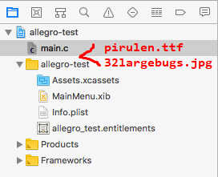

# Allegro 5 Template for I2P(1)_2018_SR

We will use Allegro 5 in the final project.

## Administrative

[iLMS Course Site](https://lms.nthu.edu.tw/course/35278)

- 12/13 (四) Allegro5 簡介

  希望在講解前大家可以先把 Allegro5 在自己電腦上裝好。

- 12/16 (日) 09:00-20:00 黑客松 (占總成績 2%)
- 01/14 (一) Demo, 詳情一週前會公布 (占總成績 13%)

Tasks: [tasks.zip](http://lms.nthu.edu.tw/sys/read_attach.php?id=1682437)

PPT: [allegro5_tutorial.pptx](http://lms.nthu.edu.tw/sys/read_attach.php?id=1682439)

## Installation

Follow the steps [here](docs/README.md).

- [Windows](docs/README.md#windows)
  - [Code::Blocks](docs/README.md#codeblocks): [Video](https://youtu.be/6qzWKRxw9eY), [Old Version](https://youtu.be/8A6DHSo3KT8?t=1)
  - [Dev-C++](docs/README.md#dev-c): [Video](https://youtu.be/lwscVtIUy6k)
  - [Visual Studio](docs/README.md#visual-studio): [Video](https://youtu.be/HPHd92nj0Io)
- [Mac OS](docs/README.md#mac-os)
  - [XCode](docs/README.md#xcode): [Video](https://youtu.be/7nJNDRCq5o0)
- [Others](docs/README.md#others)

<!--## Examples-->

## Useful Links

- Official Site

  [Allegro - A game programming library](https://liballeg.org/)

- Documentations

  [Allegro 5 reference manual](https://liballeg.org/a5docs/trunk/)

  [Allegro 5.0 reference manual](https://www.allegro.cc/manual/5/)

- GitHub repo

  [Source Code](https://github.com/liballeg/allegro5)

  [Examples](https://github.com/liballeg/allegro5/tree/master/examples)

## Tutorials

[C++ Allegro 5 Made Easy](https://www.youtube.com/watch?v=IZ2krJ8Ls2A&list=PL6B459AAE1642C8B4 )

[2D Game Development Course](http://fixbyproximity.com/2d-game-development-course/)

[Allegro Game Library Tutorial Series](https://www.gamefromscratch.com/page/Allegro-Tutorial-Series.aspx)

## FAQ

### Windows

- File `allegro-5.0.10-monolith-mt-debug.dll` is missing in Code::Blocks

  Find the file `allegro/bin/allegro-5.0.10-monolith-mt-debug.dll` located inside the unzipped library folder.

  Copy it to your project folder under `bin\Debug`.

- Header not found using the new version Allegro5.2 in Dev-C++

  `fatal error: allegro5/allegro.h: No such file or directory`

  The include and library paths assume that you have extracted the library using the built-in `Extract All...`, and put it into the C drive.

  A way to check if you had put them in the correct path is to see if the include path really exists in the file system.

### Mac OS

- Command not found - brew

  When installing homebrew, it'll ask you to press `Return` to continue, you must press `Enter` and type your password to continue installing.

  If you press any other keys, it'll abort the installation process.

- Password are not read by terminal

  The password you type won't be shown on the terminal (it won't have something like `****`). You can just type your password and press `Enter`.

- Cannot find resource files (when running `task_2_ans.c`)

  You should drag your files (`pirulen.ttf`, `32largebugs.jpg`) into your project.

  